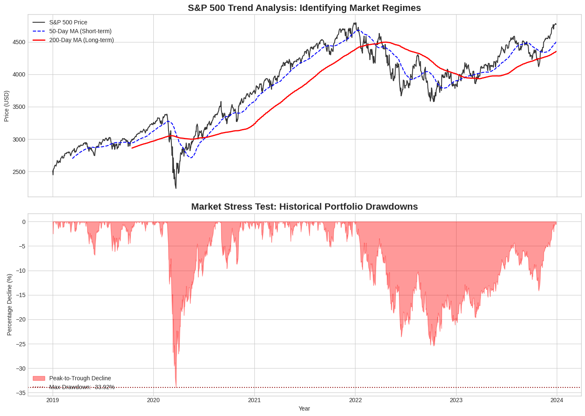
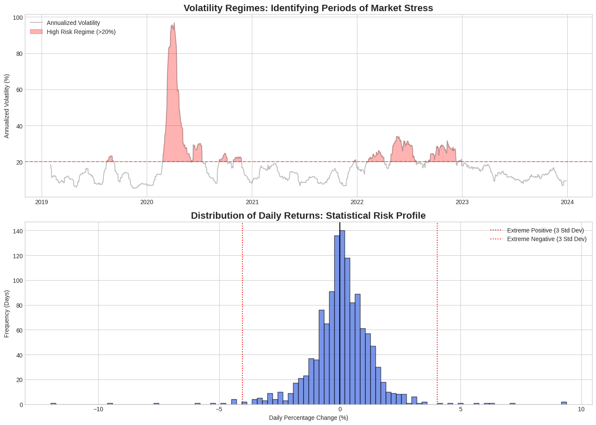
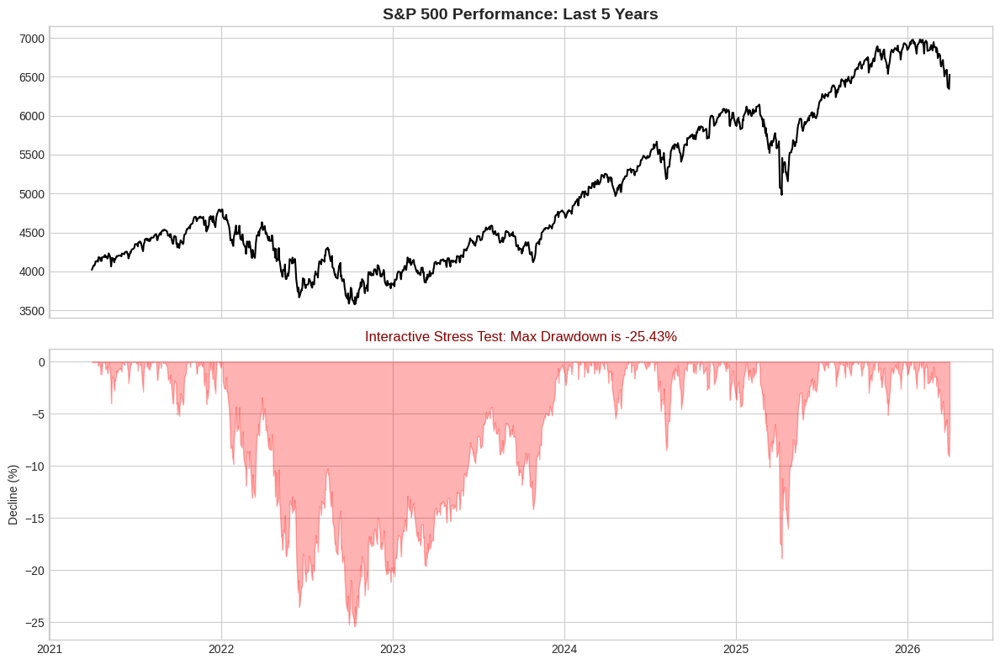

# Data-Analytics-Portfolio
# S&P 500 Market Risk & Volatility Analysis
**A Quantitative Study of Historical Market Stress and Recovery (2019–2026)**

## 📈 Executive Summary
This project utilizes Python to analyze historical S&P 500 data, identifying key market regimes and stress-testing portfolio resilience through drawdown analysis.

### 1. Market Trend Analysis
Identified long-term and short-term market regimes using 50-day and 200-day Moving Averages.

### 2. Volatility & Risk Profiling
Visualized "High Risk" regimes where annualized volatility exceeded 20%, correlating with major global economic events.

### 3. Portfolio Stress Test (Maximum Drawdown)
Quantified the peak-to-trough decline to understand historical "worst-case" scenarios for investors.

---

## 🛠️ Technical Implementation
* **Data Sourcing:** Yahoo Finance API (`yfinance`).
* **Analysis:** Python, Pandas, NumPy.
* **Visualization:** Matplotlib (Seaborn-style aesthetics).
* **Interactivity:** Integrated `ipywidgets` for dynamic time-horizon adjustments.

[🚀 Launch the Interactive Dashboard in Google Colab](https://colab.research.google.com/drive/1LrByWPNQgmJk7VN26XBZRRmGOsHXK2AE#scrollTo=Epl04AKSNOuX)
